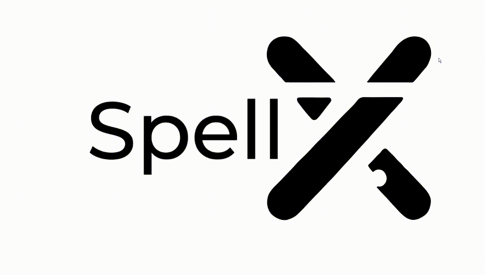

<center>

</center>
<h1 align="center">End-to-End MLOps: From Data to Deployment</h1>
<p align="center">
  <a href="https://www.python.org/"></a>
  <a href="https://github.com/IbLahlou/SpellX"></a>
  <a href="https://www.docker.com/"></a>
  <a href="https://jupyter.org/"></a>
</p>


<hr>

## Introduction
Welcome to the End-to-End MLOps Project for Spelling Orthographic Correction Automation! This repository serves as a demonstration of a complete end-to-end MLOps solution designed to streamline and enhance the development, deployment, and upkeep of machine learning models dedicated to spelling orthographic correction. In this context, MLOps represents the fusion of machine learning processes with DevOps principles, delivering a framework that guarantees the repeatability, scalability, and full automation of tasks throughout the entire lifecycle of our orthographic correction model.

## Project Overview
This project offers a meticulously designed and structured pipeline tailored specifically for machine learning initiatives, encompassing every aspect of the process from initial data preprocessing to the ultimate deployment of our spelling orthographic correction model. Our primary objective is to facilitate seamless cooperation and synergy among data scientists, machine learning engineers, and operations teams. This synergy is geared towards optimizing the entire workflow, resulting in an exceptionally efficient and dependable deployment process for our spelling orthographic correction model.

## 🚀 Features
- **Data Versioning:** DVC for version control 📊📦
- **Model Training:** BERT-based spell correction 📝🤖
- **Secure Storage:** AWS S3 artifact security 🛡️🗃️
- **User Interface:** Flask web app for correction 💬🌐
- **Project Improvement:** User feedback-driven enhancements 🔄📈👥
- **Deployment:** Docker for consistent deployment 🚀🐳
- **Hosting:** AWS ECR/EC2, custom domain 🌐🏢🌐
- **Continuous Deployment:** GitHub Actions for automation ⚙️🔄🚀
- **Monitoring:** Grafana & AWS CloudWatch 📈🔍📊

## Tech Stack
The MLOps project utilizes the following main tools and libraries:

- **NLTK (Natural Language Toolkit) 🧠:** an open-source NLP library for data processing.
- **Spello:** a library having a pretrained model for spelling correction.
- **Keras:** a deep learning framework for building and training neural networks.
- **DVC (Data Version Control) 📈:** a version control system for data sets and machine learning models.
- **Flask 🤖:** a lightweight web framework for creating APIs.
- **Docker 🐳:** a containerization platform for packaging applications.
- **Amazon EC2 ☁️:** cloud-based virtual machines for deployment.
- **AWS CloudWatch 📊:** a cloud monitoring and observability platform.
- **Grafana 📈:** a monitoring and observability platform.

## Prerequisites

Before you begin, make sure you have the following in place:

- **AWS Account:** You need an AWS account to access EC2, ECR, and S3 services.
- **Docker:** Make sure you have Docker installed on your local machine.
- **Python:** Ensure you have Python (version 3.6 or 3.8) installed.

## Architecture
![[Pasted image 20230916111157.png]]
![[Pasted image 20230916111126.png]]
![[Pasted image 20230916110530.png]]
## Data Source

[Spelling Corrector | Kaggle](https://www.kaggle.com/datasets/bittlingmayer/spelling)

## Getting Started
To get started with this project, follow these instructions to set up your environment and start working with the MLOps pipeline.

### Installation
To set up and run this project on your local machine, follow these steps:

1. Clone the repository:

```bash
git clone https://github.com/IbLahlou/SpellX
```

2. Navigate to the project directory:

```bash
cd SpellX
```

3. Install project dependencies:

```bash
pip install -e .
pip install -r requirements.txt
```

4. Run the project:

```bash
python ./main.py
```

5. Start the Flask API:

```bash
cd api
flask run
```

Now, the project is installed and running locally on your machine.


## Contributing

If you would like to contribute to this project, please fork the repository, make your changes, and submit a pull request. We welcome contributions from the community!


